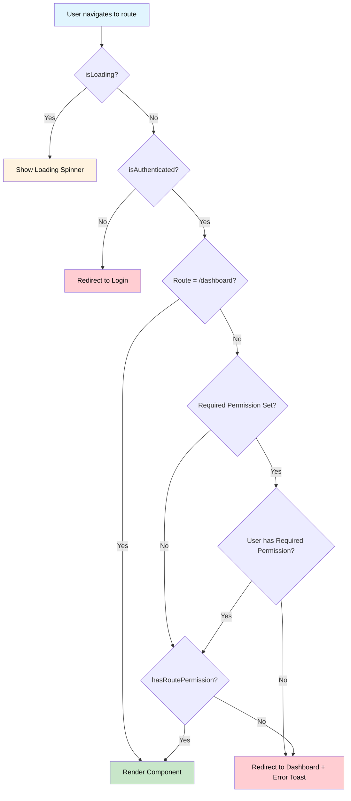

# Permission System Brief

## Overview
The QMS application uses a role-based permission system where users are assigned roles, and each role contains specific permissions. The system controls access to routes and UI elements.

## Key Components

### 1. User Structure
Users have roles with permissions stored in localStorage:
```json
{
  "employee_id": "EMP001",
  "name": "John Doe",
  "roles": [
    {
      "name": "admin",
      "permissions": ["department", "manage department", "create department"]
    }
  ]
}
```

### 2. Core Files
- **`src/utils/permissions.ts`** - Permission checking utilities
- **`src/contexts/AuthContext.tsx`** - Authentication context with permission helpers
- **`ProtectedRoute`** - Component for route protection

### 3. Permission Utilities
```typescript
hasPermission(user, permission)     // Check specific permission
hasRoutePermission(user, route)     // Check route access
getUserPermissions(user)            // Get all user permissions
```

## Usage Examples

### Protecting Routes
```tsx
<ProtectedRoute requiredPermission="view department">
  <Departments />
</ProtectedRoute>
```

### Conditional UI
```tsx
const { hasPermission } = useAuth();

{hasPermission('create department') && <Button>Create</Button>}
```

## Permission Flow
1. User navigates to route
2. Check if authenticated → redirect to login if not
3. Check route permissions → redirect to dashboard if denied
4. Render component if all checks pass

## Permission Naming
- **Resource**: `department`, `user`, `role`
- **Action**: `view department`, `create department`, `edit department`  
- **Management**: `manage department` (full access to resource)

## Permission Flow Diagram


## Access Control
- **No auth** → Login page
- **No permission** → Dashboard with error message
- **Valid access** → Requested page/component
